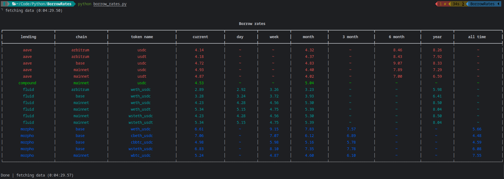

## About
Borrow APR rates parser among of 4 lendings: aave, compound, fluid, morpho.



## Install
1. ```bash
   git clone SOME && cd SOME
   ```
2. ```bash
   docker build -t borrow_rates .
   ```

## How to use
```bash
docker run -it --rm -v ./.:/app/. borrow_rates --help
```

```
Usage: borrow_rates.py [OPTIONS]

Options:
  -m, --multi INTEGER             number of simultaneous requests
  -l, --lending [all|aave|fluid|compound|morpho]
                                  lending to search token  [default: all]
  -t, --token TEXT                token to search borrow rates
  --help                          Show this message and exit.
```

the ```sources.py``` file contains sources for searching and contains a basic example, when adding your own url be careful with the “token” field, it must be a whole or end in.

the ```config.py``` file contains some settings, including proxy and colors for the output table.

the results of each run are written to a .csv file, they can be found in the “csv” directory.

## Examples
- aave lending and usdc token to search, 2 thread:
  - ```bash
    docker run -it --rm -v ./.:/app/. borrow_rates -l aave -t usdc -m 2
    ```
- all lendings and all tokens in sync mode:
  - ```bash
    docker run -it --rm -v ./.:/app/. borrow_rates
    ```

## Error fixing
Errors where “timeout” is mentioned can be fixed in two ways:
- increase timeout in the `config.py`.
- use fewer threads “-m”, or sync mode.

If this does not help, then probably UI has changed critically for parser operation.